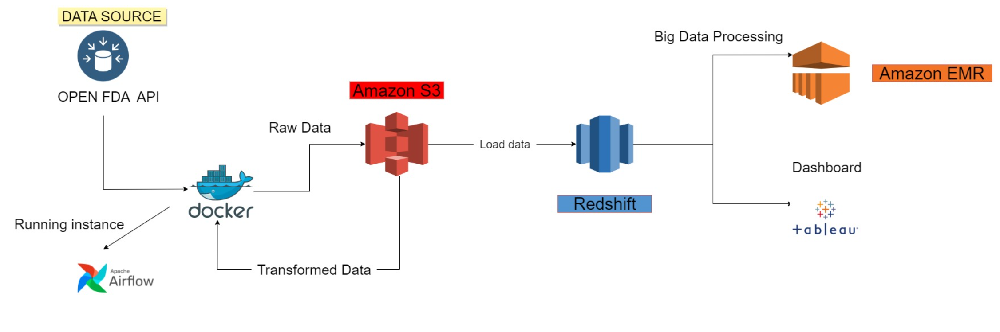

# Analysis_of_FDA_Medical_Device_Recall

**GitHub Methodology for FDA Medical Device Recall Analysis with File Execution Process**

### 1. **Repository Structure:**
   - **dags/etl/load:**
     - Contains scripts for pulling raw data from the FDA Open API.
     - Run `extract_data.py` to initiate the data extraction process.
   - **dags/etl/transformation:**
     - Stores configurations and scripts for storing raw data in Amazon S3.
     - Run `store_in_s3.py` to securely store raw data in Amazon S3.
   - **dags/etl/sparktransformation:**
     - Dockerized scripts for isolating and running the data transformation process.
     - Execute `docker-compose up` in /data_transformation to run the transformation.
   - **docker-compose:**
     - Utilizes Apache Airflow for managing the workflow, including scheduling and monitoring.
     - Use Airflow's web interface to monitor and trigger workflows.

### 2. **Data Extraction:**
   - Execute `python data_ingestion.py` in /data_extraction to pull raw data from the FDA Open API.
   - Ensure proper API authentication and handle potential API rate limits.
   - Monitor extraction logs for any errors.

### 3. **Data Storage:**
   - Run `python load.py` in /data_storage to store raw data securely in Amazon S3.
   - Implement error handling and logging to capture storage failures.
   - Verify data integrity in the S3 bucket.

### 4. **Data Transformation:**
   - Use Docker to create isolated environments for running data transformation scripts.
   - Execute `docker-compose up` in /data_transformation to initiate the transformation process.
   - Monitor Docker logs for any dependencies or runtime issues.
   - Document dependencies and configurations within the Docker containers.

### 5. **Workflow Management:**
   - Utilize Apache Airflow for orchestrating the data processing workflow.
   - Access the Airflow web interface to monitor task execution and history.
   - Schedule workflows using Airflow's scheduler.

### 6. **Transformed Data:**
   - Monitor the transformed data in Amazon Redshift for efficient querying.
   - Run necessary data quality checks to ensure integrity.
   - Implement error handling for potential issues during transformation.

### 7. **Big Data Processing:**
   - Use Amazon EMR for large-scale data processing if needed.
   - Execute EMR clusters with appropriate configurations.
   - Monitor EMR cluster performance and costs.

### 8. **Visualization and Reporting:**
   - Use Tableau to create interactive dashboards in /visualization.
   - Connect Tableau to Amazon Redshift for real-time data visualization.
   - Update Tableau visualizations with the latest data.

### 9. **Documentation:**
   - Maintain thorough documentation in README files for setup, configuration, and usage of each module.
   - Include step-by-step guides for running scripts and processes.
   - Document any known issues and troubleshooting steps.

### 10. **Collaboration and Version Control:**
   - Utilize Git for version control, creating branches for feature development and bug fixes.
   - Use GitHub Actions for continuous integration and automated testing.
   - Encourage collaboration through pull requests and utilize GitHub Issues for tracking tasks.

### Presentation Link
https://docs.google.com/presentation/d/1h6vaT9aVDvd0NMPH7OBFYhO0k0P7u95ml7VCzx1z-3s/edit?usp=sharing

### Collaborators
- Charan Kanwal Preet Singh
- Shouvik Sengupta
- Sushil R Deore
- Shivam Sawhney
